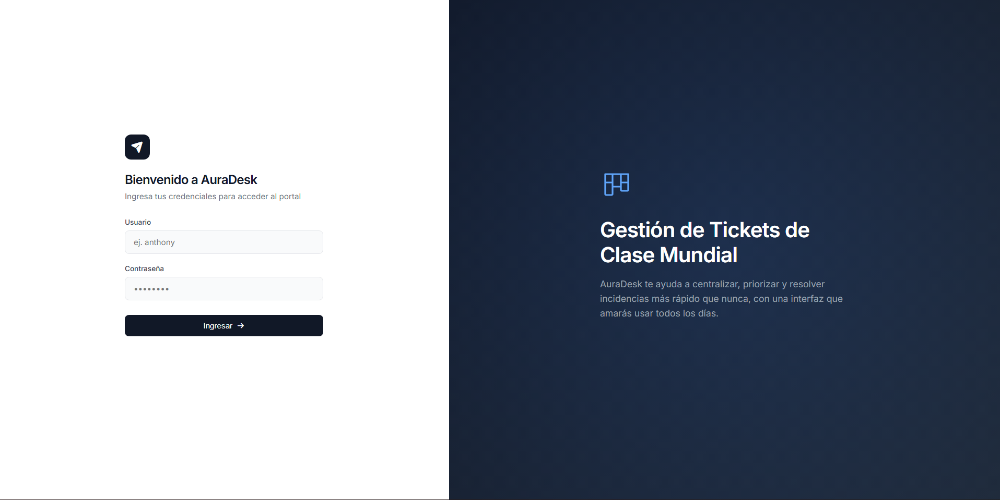
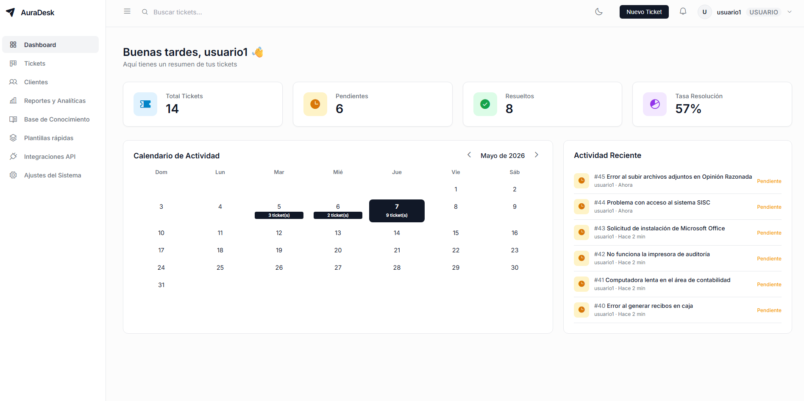
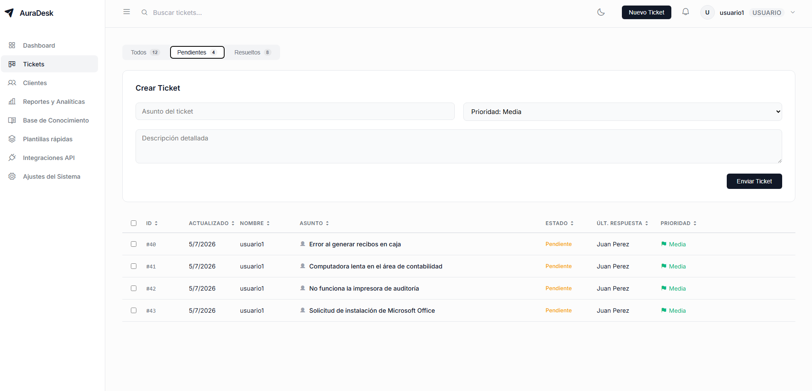
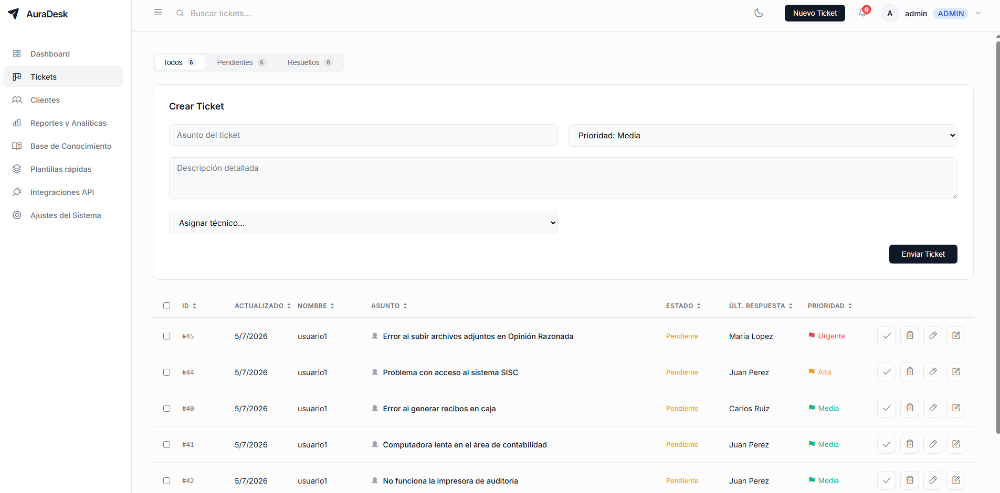

# AuraDesk - Sistema de Gestión de Tickets

[English version below](#auradesk---ticket-management-system)

Un sistema moderno de help desk para la gestión de tickets de soporte técnico. Permite crear, asignar, dar seguimiento y resolver incidencias de manera eficiente, con notificaciones en tiempo real y panel de estadísticas.

## Características Principales

- **Autenticación JWT** con roles (admin/usuario)
- **Gestión completa de tickets** (crear, editar, resolver, eliminar)
- **Sistema de prioridades** (Baja, Media, Alta, Urgente)
- **Asignación de técnicos** (automática al jefe, manual por admin)
- **Comentarios en tickets** con notificaciones automáticas
- **Notificaciones en tiempo real** (nuevos tickets, cambios de estado, comentarios)
- **Dashboard interactivo** con KPIs y calendario de actividad
- **Filtros y búsqueda** de tickets
- **Modo oscuro/claro** persistente
- **Interfaz moderna** con Phosphor Icons y diseño responsive
- **Calendario de actividad** mensual con eventos

## Tecnologías Utilizadas

### Backend
- **Node.js** - Entorno de ejecución
- **Express.js 5** - Framework web
- **MySQL** (mysql2) - Base de datos relacional
- **JWT** (jsonwebtoken) - Autenticación basada en tokens
- **bcrypt** - Encriptación de contraseñas
- **dotenv** - Variables de entorno
- **cors** - Manejo de CORS
- **multer** - Subida de archivos
- **socket.io** - WebSockets (preparado para tiempo real)

### Frontend
- **HTML5 / CSS3 / JavaScript (Vanilla)** - Sin frameworks
- **Phosphor Icons** - Iconografía moderna
- **LocalStorage** - Persistencia de sesión y preferencias
- **Inter Font** - Tipografía profesional

## Estructura del Proyecto

```
sistema-tickets/
├── backend/
│   ├── middleware/
│   │   ├── authMiddleware.js    # Verificación de JWT
│   │   └── roleMiddleware.js    # Verificación de roles
│   ├── routes/
│   │   ├── auth.js              # Registro y login
│   │   ├── tickets.js           # CRUD de tickets
│   │   ├── tecnicos.js          # Gestión de técnicos
│   │   ├── comments.js          # Sistema de comentarios
│   │   ├── notifications.js     # Notificaciones DB
│   │   └── stats.js             # Estadísticas (admin)
│   ├── db.js                    # Conexión MySQL
│   └── server.js                # Servidor Express
├── frontend/
│   ├── index.html               # Dashboard principal (SPA)
│   ├── login.html               # Página de login/registro
│   ├── dashboard.html           # Dashboard de estadísticas (admin)
│   ├── app.js                   # Lógica principal del dashboard
│   ├── login.js                 # Lógica de autenticación
│   ├── dashboard.js             # Lógica del dashboard de stats
│   ├── authCheck.js             # Verificación de autenticación
│   ├── messages.js              # Sistema de toasts y loading
│   ├── style.css                # Estilos principales
│   └── login.css                # Estilos de login
├── .env.example                 # Ejemplo de variables de entorno
├── fix_paths.js                 # Utilidad para arreglar rutas API
├── .gitignore
├── package.json
└── README.md
```

## Instalación

### Prerrequisitos
- Node.js (v16 o superior)
- Servidor MySQL en ejecución

### Pasos

1. Clona el repositorio:
```bash
git clone https://github.com/AnthonyAndino/sistema-tickets.git
cd sistema-tickets
```

2. Instala las dependencias:
```bash
npm install
```

3. Configura las variables de entorno:
```bash
cp .env.example .env
```
Edita el archivo `.env` con tus credenciales (ver sección siguiente).

4. Crea la base de datos en MySQL:
```sql
CREATE DATABASE tickets_db CHARACTER SET utf8mb4 COLLATE utf8mb4_unicode_ci;
```

5. Ejecuta las migraciones versionadas:
```bash
npm run db:migrate
```

6. Inicia el servidor:
```bash
npm start
```

El servidor corre en `http://localhost:3000`. En PowerShell, crea la configuracion local con `Copy-Item .env.example .env` antes de editar las credenciales.

Las migraciones crean el esquema cuando la base esta vacia y agregan cambios versionados sin renumerar archivos anteriores. El migrador se detiene si encuentra tablas de la aplicacion sin un historial `schema_migrations` utilizable; no vuelve a ejecutar alteraciones historicas sobre una base existente sin trazabilidad. La migracion `023_idempotencia_y_relaciones_cuentas.sql` agrega claves idempotentes y una relacion opcional de trazabilidad `incidencias_cuentas.ticket_id`; las incidencias de cuentas siguen siendo registros independientes y al borrar su ticket asociado la referencia queda en `NULL`, sin borrar ni resolver la incidencia.

### Migraciones y adopcion de bases existentes

- En una base nueva, crea una base vacia y ejecuta `npm run db:migrate`.
- Antes de actualizar una base existente, crea y verifica un respaldo y ensaya la actualizacion sobre una copia aislada.
- Si la base existente no tiene historial, compara su esquema con cada archivo de `database/migrations/`. Solo despues de confirmar que una migracion esta completamente aplicada, registra su nombre exacto en `schema_migrations`; no marques como aplicada una migracion parcialmente ejecutada ni insertes todas las versiones a ciegas. Luego ejecuta `npm run db:migrate` para aplicar las versiones pendientes.
- Si el historial tiene huecos, revisa y reconcilia manualmente el esquema y el historial en la copia; el migrador rechaza continuar fuera de orden.
- Antes de `023`, corrige en la copia cualquier `incidencias_cuentas.ticket_id` que no apunte a un ticket existente. El migrador comprueba referencias huérfanas antes de añadir la clave foránea.
- No edites ni renombres migraciones ya aplicadas. Para cambios futuros, agrega una nueva migracion con version consecutiva.

Para las pruebas de integracion, usa exclusivamente un esquema desechable cuyo nombre termine en `_test`; define `UTEA_TEST_DB_ALLOW_INTEGRATION=1` y las variables `UTEA_TEST_DB_HOST`, `UTEA_TEST_DB_PORT`, `UTEA_TEST_DB_USER`, `UTEA_TEST_DB_PASSWORD` y `UTEA_TEST_DB_NAME`, y ejecuta `npm run test:integration`. El proceso de prueba no carga `.env`, exige el sufijo `_test` y no envia notificaciones reales.

## Configuración de Variables de Entorno

Edita el archivo `.env` con tus valores:

```
DB_HOST=localhost
DB_PORT=3306
DB_USER=root
DB_PASSWORD=
DB_NAME=tickets_db
JWT_SECRET=cambia_esto_por_un_secreto_largo_y_aleatorio
PORT=3000
```

En produccion, configura un usuario MySQL dedicado con permisos limitados y reemplaza `JWT_SECRET` por un valor aleatorio privado.

## API Endpoints

### Autenticación
| Método | Endpoint | Descripción | Auth |
|--------|----------|-------------|------|
| POST | `/api/auth/register` | Registrar usuario | No |
| POST | `/api/auth/login` | Iniciar sesión | No |
| GET | `/api/auth/me` | Obtener la identidad y el rol vigentes | JWT |
| GET | `/api/auth/me/profile` | Consultar el perfil propio | JWT |
| PUT | `/api/auth/me/profile` | Actualizar nombre completo y correo institucional propios | JWT |
| PATCH | `/api/auth/me/password` | Cambiar la contraseña verificando la actual | JWT |

Los endpoints de perfil usan exclusivamente la identidad autenticada; no aceptan identificadores de usuario ni permiten cambiar rol, permisos u oficina. El nombre completo debe tener hasta 150 caracteres y el correo institucional debe ser válido y único. La nueva contraseña debe tener al menos 6 caracteres.

### Catalogos institucionales
Todos los endpoints requieren JWT. Las operaciones de escritura requieren rol `admin`.

| Método | Endpoint | Descripción |
|--------|----------|-------------|
| GET | `/api/catalogos/oficinas` | Listar oficinas activas (admin ve todas) |
| POST | `/api/catalogos/oficinas` | Crear oficina (`codigo`, `nombre`, `descripcion`) |
| PATCH | `/api/catalogos/oficinas/:id` | Actualizar oficina o activar/desactivar |
| GET | `/api/catalogos/categorias?oficina_id=:id` | Listar categorías y subcategorías de una oficina |
| POST | `/api/catalogos/categorias` | Crear categoría (`oficina_id`, `codigo`, `nombre`, opcional `categoria_padre_id`) |
| PATCH | `/api/catalogos/categorias/:id` | Actualizar categoría o activar/desactivar |
| GET | `/api/catalogos/oficinas/:id/tecnicos` | Listar técnicos asociados y responsables |
| PUT | `/api/catalogos/oficinas/:id/tecnicos/:tecnicoId` | Asociar técnico (`es_responsable` opcional) |
| DELETE | `/api/catalogos/oficinas/:id/tecnicos/:tecnicoId` | Desasociar técnico de oficina |

### Tickets (Requiere JWT)
| Método | Endpoint | Descripción | Rol |
|--------|----------|-------------|-----|
| GET | `/api/tickets` | Obtener tickets (admin: todos, usuario: propios) | JWT |
| POST | `/api/tickets` | Crear ticket; asigna a técnico de oficina si se clasifica, si no usa el técnico jefe legacy | JWT |
| PUT | `/api/tickets/:id` | Editar ticket (título, descripción, estado, técnico) | Admin |
| DELETE | `/api/tickets/:id` | Eliminar ticket | Admin |

El formulario y la API requieren nombre del solicitante, código universitario o DNI, tipo de solicitante, carrera, categoría de soporte, bloque, ambiente, impacto y urgencia. La oficina y categoría institucional son obligatorias, deben estar activas y pertenecer entre sí; el ambiente debe corresponder al bloque y el número de aula solo se solicita para salones/aulas. Las solicitudes POST requieren un encabezado `Idempotency-Key`; conserva la misma clave al reintentar la misma solicitud.

Campos adicionales aceptados por `POST /api/tickets`: `oficina_id`, `categoria_id`, `ubicacion`, `solicitante_nombre`, `codigo_universitario_dni` y `tipo_solicitante` (`estudiante`, `docente` o `administrativo`).

### Técnicos
| Método | Endpoint | Descripción |
|--------|----------|-------------|
| GET | `/api/tecnicos` | Obtener lista de técnicos |

### Comentarios (Requiere JWT)
| Método | Endpoint | Descripción |
|--------|----------|-------------|
| GET | `/api/comentarios/:ticketId` | Obtener comentarios de un ticket |
| POST | `/api/comentarios` | Agregar comentario (notifica automáticamente) |

### Notificaciones (Requiere JWT)
| Método | Endpoint | Descripción |
|--------|----------|-------------|
| GET | `/api/notificaciones` | Obtener últimas 20 notificaciones |
| GET | `/api/notificaciones/count` | Contar no leídas |
| PUT | `/api/notificaciones/leer` | Marcar todas como leídas |
| PUT | `/api/notificaciones/:id/leer` | Marcar una como leída |

### Estadísticas (Solo Admin)
| Método | Endpoint | Descripción |
|--------|----------|-------------|
| GET | `/api/stats` | Obtener estadísticas del sistema |

### Autenticación JWT
Incluye el token en el header:
```
Authorization: Bearer <token>
```

## Uso del Sistema

### Panel de Administrador
- Ver todos los tickets del sistema
- Crear, editar y eliminar cualquier ticket
- Cambiar estado (Pendiente/Resuelto)
- Asignar técnicos a tickets
- Ver estadísticas en `/api/stats`
- Recibir notificaciones de nuevos tickets y comentarios

### Panel de Usuario
- Crear nuevos tickets con prioridad
- Ver solo sus propios tickets
- Agregar comentarios a sus tickets
- Recibir notificaciones cuando admin cambia estado o comenta

### Funciones Destacadas
- **Dashboard con KPIs**: Total, Pendientes, Resueltos, Tasa de resolución
- **Calendario mensual**: Visualiza la actividad de tickets por día
- **Actividad reciente**: Últimos tickets con tiempo relativo
- **Búsqueda en tiempo real**: Filtra tickets por título, usuario o ID
- **Filtros rápidos**: Botones para Todos / Pendientes / Resueltos
- **Modo oscuro**: Toggle persistente en localStorage
- **Notificaciones**: Badge con conteo y dropdown con historial

## Vistas del Frontend

| Vista | Archivo | Descripción |
|-------|---------|-------------|
| Dashboard Principal | `index.html` | KPIs, calendario y actividad reciente (SPA) |
| Login | `login.html` | Página de inicio de sesión y registro |
| Estadísticas | `dashboard.html` | Panel de estadísticas (solo admin) |

## Capturas de Pantalla

### Login


### Dashboard Principal


### Gestión de Tickets


### Vista de Administrador


## Scripts Disponibles

```bash
npm start       # Inicia el servidor en producción
npx nodemon backend/server.js  # Modo desarrollo con recarga automática
node fix_paths.js              # Arreglar rutas de API en archivos frontend
```

## Mejoras Futuras

- [ ] Implementar Socket.io para notificaciones en tiempo real (ya instalado)
- [ ] Subida de archivos adjuntos a tickets (multer ya instalado)
- [ ] Paginación en la lista de tickets
- [ ] Filtros avanzados por fecha, prioridad y técnico
- [ ] Historial de cambios de estado
- [ ] Panel de estadísticas visual (gráficos)
- [ ] Implementar vistas estáticas (Clientes, Reportes, etc.)
- [ ] Recordatorios automáticos para tickets vencidos
- [ ] Exportar tickets a PDF/Excel

## Contribución

1. Haz un fork del proyecto
2. Crea una rama para tu feature (`git checkout -b feature/nueva-funcionalidad`)
3. Haz commit de tus cambios (`git commit -m 'Agrega nueva funcionalidad'`)
4. Haz push a la rama (`git push origin feature/nueva-funcionalidad`)
5. Abre un Pull Request

## Contribución

1. Haz un fork del proyecto
2. Crea una rama para tu feature (`git checkout -b feature/nueva-funcionalidad`)
3. Haz commit de tus cambios (`git commit -m 'Agrega nueva funcionalidad'`)
4. Haz push a la rama (`git push origin feature/nueva-funcionalidad`)
5. Abre un Pull Request

## Mejoras Futuras

- [ ] Implementar roles de usuario (admin, técnico, usuario)
- [ ] Agregar paginación a la lista de tickets
- [ ] Filtros avanzados por fecha y estado
- [ ] Notificaciones en tiempo real
- [ ] Historial de cambios de tickets
- [ ] Panel de estadísticas y reportes

## Scripts Disponibles

```bash
npm start       # Inicia el servidor en producción
npm run dev     # Inicia el servidor con nodemon (desarrollo)
```

## Licencia

ISC

---

# AuraDesk - Ticket Management System

A modern help desk system for managing technical support tickets. It allows you to create, assign, track, and resolve incidents efficiently, with real-time notifications and statistics dashboard.

## Main Features

- **JWT Authentication** with roles (admin/user)
- **Complete ticket management** (create, edit, resolve, delete)
- **Priority system** (Low, Medium, High, Urgent)
- **Technician assignment** (automatic to supervisor, manual by admin)
- **Ticket comments** with automatic notifications
- **Real-time notifications** (new tickets, status changes, comments)
- **Interactive Dashboard** with KPIs and activity calendar
- **Filters and search** for tickets
- **Dark/Light mode** with persistence
- **Modern UI** with Phosphor Icons and responsive design
- **Monthly activity calendar** with events

## Technologies Used

### Backend
- **Node.js** - Runtime environment
- **Express.js 5** - Web framework
- **MySQL** (mysql2) - Relational database
- **JWT** (jsonwebtoken) - Token-based authentication
- **bcrypt** - Password encryption
- **dotenv** - Environment variables
- **cors** - CORS handling
- **multer** - File uploads
- **socket.io** - WebSockets (ready for real-time)

### Frontend
- **HTML5 / CSS3 / JavaScript (Vanilla)** - No frameworks
- **Phosphor Icons** - Modern iconography
- **LocalStorage** - Session persistence and preferences
- **Inter Font** - Professional typography

## Project Structure

```
sistema-tickets/
├── backend/
│   ├── middleware/
│   │   ├── authMiddleware.js    # JWT verification
│   │   └── roleMiddleware.js    # Role verification
│   ├── routes/
│   │   ├── auth.js              # Register and login
│   │   ├── tickets.js           # Ticket CRUD
│   │   ├── tecnicos.js          # Technician management
│   │   ├── comments.js          # Comment system
│   │   ├── notifications.js     # DB notifications
│   │   └── stats.js             # Statistics (admin)
│   ├── db.js                    # MySQL connection
│   └── server.js                # Express server
├── frontend/
│   ├── index.html               # Main dashboard (SPA)
│   ├── login.html               # Login/register page
│   ├── dashboard.html           # Statistics dashboard (admin)
│   ├── app.js                   # Main dashboard logic
│   ├── login.js                 # Authentication logic
│   ├── dashboard.js             # Stats dashboard logic
│   ├── authCheck.js             # Auth verification
│   ├── messages.js              # Toast and loading system
│   ├── style.css                # Main styles
│   └── login.css                # Login styles
├── .env.example                 # Environment variables example
├── fix_paths.js                 # Utility to fix API paths
├── .gitignore
├── package.json
└── README.md
```

## Installation

### Prerequisites
- Node.js (v16 or higher)
- MySQL server running

### Steps

1. Clone the repository:
```bash
git clone https://github.com/AnthonyAndino/sistema-tickets.git
cd sistema-tickets
```

2. Install dependencies:
```bash
npm install
```

3. Configure environment variables:
```bash
cp .env.example .env
```
Edit the `.env` file with your credentials (see next section).

4. Create the database and tables in MySQL:
```sql
CREATE DATABASE tickets_db;
USE tickets_db;

CREATE TABLE usuarios (
    id INT AUTO_INCREMENT PRIMARY KEY,
    username VARCHAR(255) UNIQUE NOT NULL,
    password VARCHAR(255) NOT NULL,
    rol ENUM('usuario', 'admin') DEFAULT 'usuario'
);

CREATE TABLE tecnicos (
    id INT AUTO_INCREMENT PRIMARY KEY,
    nombre VARCHAR(255) NOT NULL,
    es_jefe BOOLEAN DEFAULT FALSE
);

CREATE TABLE tickets (
    id INT AUTO_INCREMENT PRIMARY KEY,
    titulo VARCHAR(255) NOT NULL,
    descripcion TEXT,
    estado ENUM('Pendiente', 'Resuelto') DEFAULT 'Pendiente',
    prioridad ENUM('Baja', 'Media', 'Alta', 'Urgente') DEFAULT 'Media',
    tecnico_id INT,
    user_id INT,
    fecha_creacion TIMESTAMP DEFAULT CURRENT_TIMESTAMP,
    FOREIGN KEY (tecnico_id) REFERENCES tecnicos(id),
    FOREIGN KEY (user_id) REFERENCES usuarios(id)
);

CREATE TABLE comentarios (
    id INT AUTO_INCREMENT PRIMARY KEY,
    ticket_id INT NOT NULL,
    user_id INT NOT NULL,
    comentario TEXT NOT NULL,
    fecha TIMESTAMP DEFAULT CURRENT_TIMESTAMP,
    FOREIGN KEY (ticket_id) REFERENCES tickets(id) ON DELETE CASCADE,
    FOREIGN KEY (user_id) REFERENCES usuarios(id) ON DELETE CASCADE
);

-- Insert a supervisor technician (required for automatic assignment)
INSERT INTO tecnicos (nombre, es_jefe) VALUES ('Supervisor Technician', TRUE);
```

5. Start the server:
```bash
node backend/server.js
```

Server runs at `http://localhost:3000`

## Environment Variables Configuration

Edit the `.env` file with your values:

```
DB_HOST=localhost
DB_USER=root
DB_PASSWORD=your_password
DB_NAME=tickets_db
JWT_SECRET=very_long_secure_secret_key
PORT=3000
```

## API Endpoints

### Authentication
| Method | Endpoint | Description | Auth |
|--------|----------|-------------|------|
| POST | `/api/auth/register` | Register user (optional role: admin/user) | No |
| POST | `/api/auth/login` | Login | No |

### Tickets (Requires JWT)
| Method | Endpoint | Description | Role |
|--------|----------|-------------|------|
| GET | `/api/tickets` | Get tickets (admin: all, user: own) | JWT |
| POST | `/api/tickets` | Create ticket (auto-assigns to supervisor) | JWT |
| PUT | `/api/tickets/:id` | Edit ticket (title, description, status, technician) | Admin |
| DELETE | `/api/tickets/:id` | Delete ticket | Admin |

### Technicians
| Method | Endpoint | Description |
|--------|----------|-------------|
| GET | `/api/tecnicos` | Get technician list |

### Comments (Requires JWT)
| Method | Endpoint | Description |
|--------|----------|-------------|
| GET | `/api/comentarios/:ticketId` | Get ticket comments |
| POST | `/api/comentarios` | Add comment (auto-notifies) |

### Notifications (Requires JWT)
| Method | Endpoint | Description |
|--------|----------|-------------|
| GET | `/api/notificaciones` | Get last 20 notifications |
| GET | `/api/notificaciones/count` | Count unread |
| PUT | `/api/notificaciones/leer` | Mark all as read |
| PUT | `/api/notificaciones/:id/leer` | Mark one as read |

### Statistics (Admin Only)
| Method | Endpoint | Description |
|--------|----------|-------------|
| GET | `/api/stats` | Get system statistics |

### JWT Authentication
Include the token in the header:
```
Authorization: Bearer <token>
```

## System Usage

### Admin Panel
- View all system tickets
- Create, edit and delete any ticket
- Change status (Pending/Resolved)
- Assign technicians to tickets
- View statistics at `/api/stats`
- Receive notifications for new tickets and comments

### User Panel
- Create new tickets with priority
- View only their own tickets
- Add comments to their tickets
- Receive notifications when admin changes status or comments

### Featured Functions
- **Dashboard with KPIs**: Total, Pending, Resolved, Resolution rate
- **Monthly calendar**: Visualize ticket activity by day
- **Recent activity**: Latest tickets with relative time
- **Real-time search**: Filter tickets by title, user or ID
- **Quick filters**: Buttons for All / Pending / Resolved
- **Dark mode**: Persistent toggle in localStorage
- **Notifications**: Badge with count and dropdown with history

## Frontend Views

| View | File | Description |
|------|------|-------------|
| Main Dashboard | `index.html` | KPIs, calendar and recent activity (SPA) |
| Login | `login.html` | Login and registration page |
| Statistics | `dashboard.html` | Statistics dashboard (admin only) |

## Available Scripts

```bash
npm start       # Start server in production
npx nodemon backend/server.js  # Development mode with auto-reload
node fix_paths.js              # Fix API paths in frontend files
```

## Future Improvements

- [ ] Implement Socket.io for real-time notifications (already installed)
- [ ] File attachments upload for tickets (multer already installed)
- [ ] Pagination in ticket list
- [ ] Advanced filters by date, priority and technician
- [ ] Status change history
- [ ] Visual statistics dashboard (charts)
- [ ] Implement static views (Clients, Reports, etc.)
- [ ] Automatic reminders for overdue tickets
- [ ] Export tickets to PDF/Excel

## Contributing

1. Fork the project
2. Create a feature branch (`git checkout -b feature/new-feature`)
3. Commit your changes (`git commit -m 'Add new feature'`)
4. Push to the branch (`git push origin feature/new-feature`)
5. Open a Pull Request

## License

ISC
